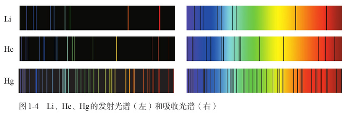

本页对应 [普通高中教科书 化学 选择性必修2 物质结构与性质](https://book.pep.com.cn/1442001132201/mobile/index.html) 第7-8页。

前置知识：[原子结构](atomic-structure.md)

# 基态与激发态

原子可以吸收能量，在吸收能量后，部分电子会跃迁到能量更高的原子轨道。我们将处于能量最低状态的原子称之为 **基态原子**，吸收能量后则变为 **激发态原子**。

当然，激发态原子中的电子也会跃迁到能量更低的原子轨道，过程中通常会以 **不同波长的光** 的形式释放能量。

# 光谱

将一束光中不同波长的部分按照波长水平排列，就可以得到 **光谱**。

每一条竖直线都对应了一个波长，这些竖直线被称为 **谱线**，谱线的亮暗代表了对应波长的光的强度。

# 原子光谱

不同波长的光具有不同的能量。

由于每一个能级是离散的（即每一个能级的能量值不是连续增长的），所以当电子在能量不同的能级间跃迁的时候，吸收/释放的能量也不是连续的，因此吸收/释放的光的波长也不是连续的。对应到原子发出/吸收后的光的光谱，可以发现光谱中某些位置出现了突变。这些位置被称为 **特征谱线**。

每种元素的特征谱线具有独特性。在现代化学中，往往使用原子光谱中的特征谱线来鉴定元素，这被称之为 **光谱分析**。
