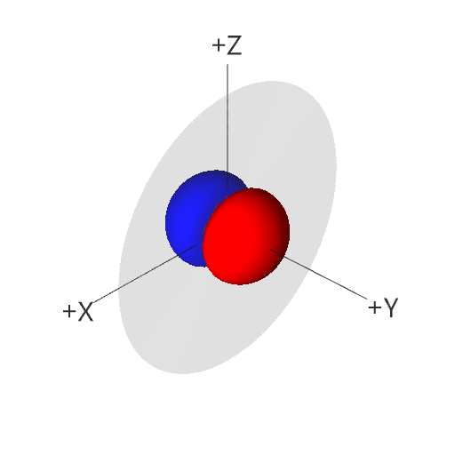
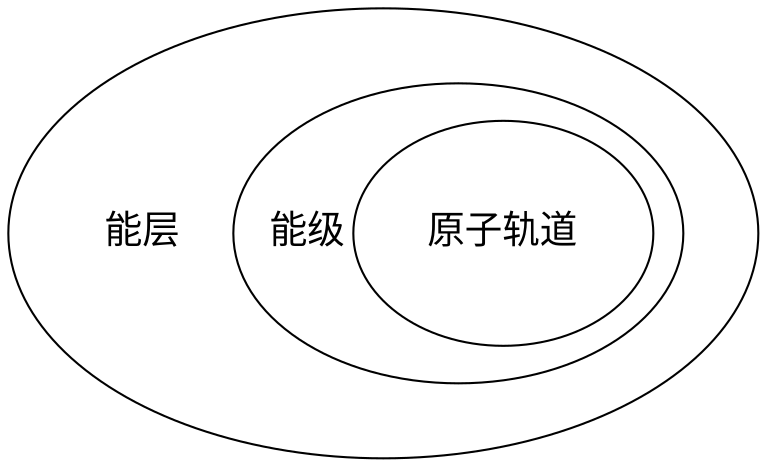

# 前言

在初中，我们已经初步了解了原子的结构，即原子由带正电荷的原子核和带负电荷的外围电子组成，其中外围电子呈轨道状分层围绕原子核运动。

在高中，电子的运动状态得到了进一步细化，我们引入了能层、能级与原子轨道等概念来解释电子绕核的运动。

值得一提的是，量子力学的研究表明，电子并不是像行星绕日一样在线性轨道上运行，而是原子核周围空间都有一定概率出现。我们常用电子云来直观描述这种分布。

# 电子排布分级

## 概念

1. **电子云**：按电子在不同位置出现的概率随机取样得到的结果图
2. **电子云轮廓**：为了直观展现电子云分布范围，将一个电子出现概率高（通常高于 90%）的区域轮廓称为电子云轮廓
3. **能层**：按离原子核的平均距离从近到远划分成的若干层级，分别用 $\mathrm{K}$, $\mathrm{L}$, $\mathrm{M}$, $\mathrm{N}$, $\mathrm{O}$, $\mathrm{P}$, $\mathrm{Q}$ 表示
4. **能级**：每一个能层中决定能量高低顺序的不同亚层。同一能层中，第 n 能层中的能级按能量由低至高分别用 $n\mathrm{s}$, $n\mathrm{p}$, $n\mathrm{d}$, $n\mathrm{f}$ 表示。
5. **原子轨道**：电子在原子核外的一个空间运动状态。每一个能级都对应着若干能量相等的原子轨道（统称为简并轨道）
6. **电子自旋**：电子自旋值有两种可能：自旋向上或自旋向下，用上箭头和下箭头表示自旋方向相反的电子。

## 性质

1. 电子云中点越密集的地方电子出现的概率越高，越稀疏的地方电子出现的概率越低
2. 每一条原子轨道的电子云轮廓图都有不同的形状，例如，$\mathrm{s}$ 轨道的轮廓是球形的，$\mathrm{p}$ 轨道的轮廓是哑铃状的，其中的三条轨道分别按其轴向命名为 $\mathrm{p_x}$，$\mathrm{p_y}$，$\mathrm{p_z}$。 例：$\mathrm{p_y}$ 原子轨道的电子云轮廓图

3. 每一个原子轨道 **最多** 只能容纳 **两种** **不同** 自旋状态的电子（即 [泡利原理](#泡利原理)）
4. 每一个能级包含的原子轨道数目是 **不同** 的；例：$\mathrm{s}$ 包含 $\mathrm{1}$ 条，$\mathrm{p}$ 包含 3 条，$\mathrm{d}$ 包含 5 条，$\mathrm{f}$ 包含 7 条。
5. 电子处于的能层距离原子核 **越远**，电子的能量 **越高**。
6. 对于处于 **高能层低能级** 的电子和处于 **低能层高能级** 的电子，可能会出现 **低能层高能级** 的电子能量大于 **高能层低能级** 的情况，这被称为 **能级交错**；例：$\mathrm{4s}$ 的能量值 $<$ $\mathrm{3d}$ 的能量值
7. 第 n 能层包含 n 种能级；例：第 1 能层只包含 $\mathrm{1s}$ 能级，第 2 能层只包含 $\mathrm{2s}$, $\mathrm{2p}$ 能级

## 关系

有关电子排布的顺序，见 [电子排布规律](#电子排布规律)。

# 电子排布的表示方法

## 电子排布式

对于每一个能级，将该能级上所排布的的 **电子数** 书写在能级的右上角，就是电子排布式。

一般而言，存在两种书写电子排布式的顺序：

1. 按照 **先能层 后能级** 的顺序 **从低到高** 依次填写
2. 按照 **电子填充** 的顺序依次填写

例：

| 元素    | 电子排布式                                    |
|---------|-----------------------------------------------|
| 氢 (H)  | $\mathrm{1s^1}$                               |
| 氮 (N)  | $\mathrm{1s^2 2s^2 2p^3}$                     |
| 铁 (Fe) | $\mathrm{1s^2 2s^2 2p^6 3s^2 3p^6 3d^6 4s^2}$ |

## 简化电子排布式

为了简化书写，我们将内层电子已经达到 **稀有气体元素**（即上一个周期最后一个元素）结构的部分用稀有气体元素的符号代替。

例：

| 元素    | 简化电子排布式            | 电子排布式                                    |
|---------|---------------------------|-----------------------------------------------|
| 硫 (S)  | $\mathrm{[Ne] 3s^2 3p^4}$ | $\mathrm{1s^2 2s^2 2p^6 3s² 3p^4}$            |
| 钙 (Ca) | $\mathrm{[Ar] 4s^2}$      | $\mathrm{1s^2 2s^2 2p^6 3s^2 3p^6 4s^2}$      |
| 铁 (Fe) | $\mathrm{[Ar] 3d^6 4s^2}$ | $\mathrm{1s^2 2s^2 2p^6 3s^2 3p^6 3d^6 4s^2}$ |

注：氖 (Ne) 的电子排布式为：$\mathrm{1s^2 2s^2 2p^6}$，氩 (Ar) 的电子排布式为：$\mathrm{1s^2 2s^2 2p^6 3s^2 3p^6}$。

## 外围电子排布式

进一步的，把稀有气体元素的符号也省略之后，我们可以得到外围电子排布式。这常常在元素周期表上出现。

仍以硫 (S)，钙 (Ca)，铁 (Fe) 元素为例：

| 元素    | 外围电子排布式       | 
|---------|----------------------|
| 硫 (S)  | $\mathrm{3s^2 3p^4}$ |
| 钙 (Ca) | $\mathrm{4s^2}$      |
| 铁 (Fe) | $\mathrm{3d^6 4s^2}$ |

## 轨道表示式

将每一个原子轨道用一个方框表示，在方框内用上/下箭头表明电子的自旋状态。

例：

氢 (H)：&emsp;$
% \etS is a global user-defined macro, see /javascripts/katex.js for the definition.
\etS{1}{\uparrow}
$

钠 (Na)：&emsp;$
% \etS, \etP are global user-defined macros, see /javascripts/katex.js for the definitions.
\etS{1}{\uparrow\downarrow} \quad
\etS{2}{\uparrow\downarrow} \quad
\etP{2}{\uparrow\downarrow &\uparrow\downarrow & \uparrow\downarrow} \quad
\etS{3}{\uparrow}
$

铝 (Al)：&emsp;$
% \etS, \etP, \emptyT are global user-defined macros, see /javascripts/katex.js for the definitions.
\etS{1}{\uparrow\downarrow} \quad
\etS{2}{\uparrow\downarrow} \quad
\etP{2}{\uparrow\downarrow &\uparrow\downarrow & \uparrow\downarrow} \quad
\etS{3}{\uparrow} \quad
\etP{3}{\uparrow & \emptyT & \emptyT}
$

# 电子排布规律

## 能量最低原理

电子排布优先按照使 **总体能量从小到大** 的方式填充各个能级。

因为（[性质 6](#性质)），电子不一定优先填充低能层高能级的原子轨道，反而会填充高能层低能级的原子轨道，这样可以使总体能量更低。

## 泡利原理

每一个原子轨道最多只能容纳两种不同自旋状态的电子。

## 洪特规则

在能级相同的简并轨道（即一个能级所对应的能量相等的原子轨道中），电子总是优先单独分占每一条轨道，并且自旋方向相同。

基于该规则的推广：简并轨道在全满，半满，和全空状态下能量更低，结构更稳定。

!!! note "解释"

    对于半满状态，每一个电子各占一个原子轨道。

    对于全满状态，每两个电子共占一个原子轨道。

    根据洪特规则，这样的电子排布能量更低。

这会带来一些不寻常的电子排布方式，例如：铜（$\mathrm{3d^{10} 4s^1}$），铬（$\mathrm{3d^5 4s^1}$）。

以铬为例，若不考虑洪特规则的特例，其电子排布按正常填充顺序本应为 $\mathrm{3d^4 4s^2}$。但实验测定其基态排布为 $\mathrm{3d^5 4s^1}$——此时 3d 轨道半满、4s 轨道半满，整个体系能量更低、更稳定。铜的 $\mathrm{3d^{10} 4s^1}$ 排布（3d 全满、4s 半满）也是同理。
