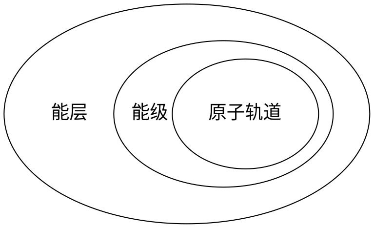

# 电子排布分级

## 概念

1. **电子云**：按电子在不同位置出现的概率随机取样得到的结果图
2. **能层**：按离原子核的平均距离从近到远划分成的若干层级，分别用 K, L, M, N, O, P, Q 表示
3. **能级**：每一个能层中决定能量高低顺序的不同亚层。同一能层中，第 n 能层中的能级按能量由低至高分别用 *n*s, *n*p, *n*d, *n*f 表示。
4. **原子轨道**：电子在原子核外的一个空间运动状态。每一个能级都对应着若干能量相等的原子轨道（统称为简并轨道）
5. **电子自旋**：电子自旋值有两种可能：顺时针或逆时针，用上箭头和下箭头表示自旋方向相反的电子。

## 性质

1. 电子云中点越密集的地方电子出现的概率越高，越稀疏的地方电子出现的概率越低
2. 每一个原子轨道 **最多** 只能容纳 **两种** **不同** 自旋状态的电子（即 [泡利原理](#_7)）
3. 每一个能级包含的原子轨道数目是 **不同** 的；例：s 包含 1 条，p 包含 3 条，d 包含 5 条，f 包含 7 条
4. 电子处于的能层距离原子核 **越远**，电子的能量 **越高**。
5. 对于处于 **高能层低能级** 的电子和处于 **低能层高能级** 的电子，可能会出现 **低能层高能级** 的电子能量 **大于** **高能层低能级** 的情况，这被称为 **能级交错**；例：4s 的能量值 < 3d 的能量值
6. 第 n 能层包含 n 个能级；例：第 1 能层只包含 1s 能级，第 2 能层只包含 2s, 2p 能级

## 关系

# 电子排布规律

## 能量最低原理

电子排布优先按照使 **总体能量从小到大** 的方式填充各个能级。

因为（[性质 5](#_3)），电子不一定优先填充低能层高能级的原子轨道，反而会填充高能层低能级的原子轨道。

## 泡利原理

每一个原子轨道最多只能容纳两种不同自旋状态的电子。

## 洪特规则

在能级相同的简并轨道（即一个能级所对应的能量相等的原子轨道中），电子总是优先单独分占每一条轨道，并且自旋方向相同。

基于该规则的推广：简并轨道在全满，半满，和全空状态下能量更低，结构更稳定。

!!! note "解释"

    对于半满状态，每一个电子占一个原子轨道。

    对于全满状态，每两个电子共占一个原子轨道。

    根据洪特规则，这样的电子排布能量更低。

这会带来一些不寻常的电子排布方式，例如：铜（$4s^1 3d^{10}$），铬（$4s^1 3d^5$）。

以铜为例，他在元素周期表中的前一位元素是镍（$4s^2 3d^8$），如果不考虑洪特定律，那么铜的电子排布式应该为：$4s^2 3d^9$。
然而，根据洪特定律，$4s^1 3d^10$ 的电子排布方式中 $4s$ 轨道为半满，$3d$ 轨道为全满，这使得这种电子排布方式下能量更低，因此铜选择了 $4s^1 3d^10$ 的电子排布方式。
